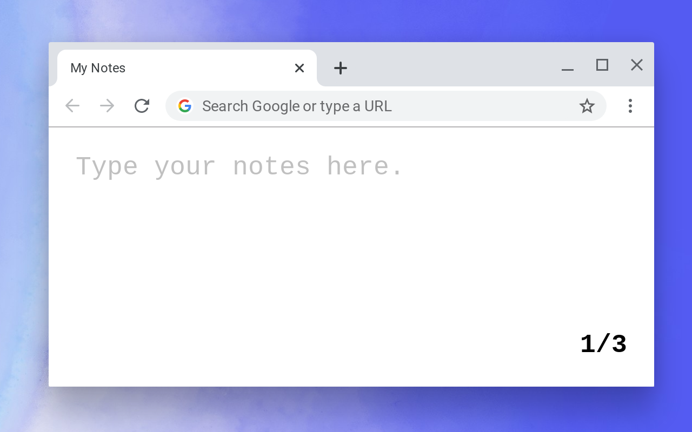

## Builds

**#3 (latest)**

- Update **design** (rounded tabs, higher contrast, no gear animation)

<br>

**#2**

- Update **design** (more blue color, gear animation)

- **Manage** Notes (Open, Close, Delete, Export)

- **Export** Notes (Open, Closed, All) in TXT or MD

- Trim **Title** on rename

<br>

**#1**

- **Add** Note with a + button

- **Select** Note with a click

- **Rename** Note with a double click

  - Type a new **Title** and apply it with **ENTER** or click outside
  - **Title** cannot be empty if Note is not empty (**Title** will be changed back)

- **Delete** Note by renaming the Title to empty (works only if Note is empty)

- **Reorder** Notes with Drag and Drop (click and hold, move)

This section _will be removed_ in a final release. **How to use** and **How to develop** are added to _README_.

<br><br>

# My Notes

**Chrome Extension** that turns your **"New Tab"** into **a note taking tool.**

- Great for Notes, Todos, and sharing text (Copy/Paste)

- It works immediately after you open a **"New Tab"**

- Every edit and paste is saved (and waiting for you once you come back)

- And! It is Synchronized across every Chrome window you have open

<br>

## ~Image~



<br>

## How to use

- **Add** Note with a + button

- **Select** Note with a click

- **Rename** Note with a double click

  - Type a new **Title** and apply it with **ENTER** or click outside
  - **Title** cannot be empty if Note is not empty (**Title** will be changed back)

- **Delete** Note by renaming the Title to empty (works only if Note is empty)

- **Reorder** Notes with Drag and Drop (click and hold, move)

<br>

## How to develop

```
$ npm run start           # builds files into bin/ and watches for changes
                          # source maps are added

$ http-server bin/ -c-0   # serves files from bin/ (caching disabled)
                          # you can use any server or open files directly
                          # server is needed for React Developer Tools


$ npm run build           # builds files into bin/ (production build)
                          # source maps are NOT added
```

**My Notes** is a **Chrome Extension** developed in **React + Redux**.
Build is done using **Webpack**.

<br>

## Support

Any inquiries can be addressed at **https://bit.ly/hellopenge** in the channel **#my-notes**.
